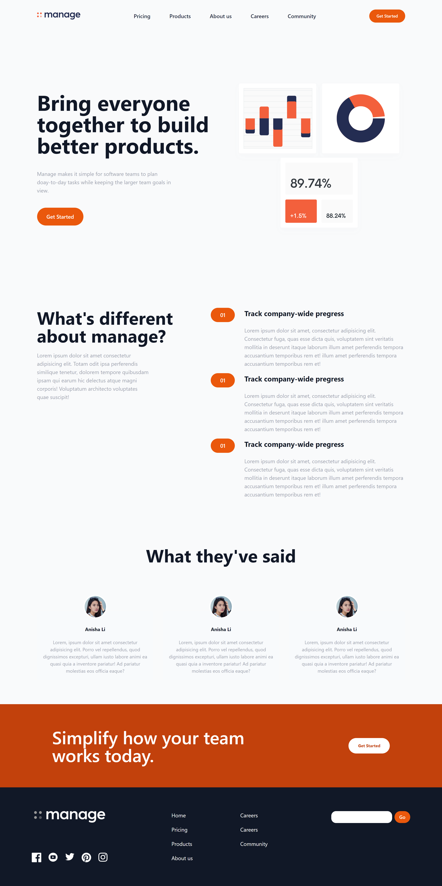

## Project overview

This project is for practice purposes. I used the tailwind CSS framework in this project to style my HTML project.
The project is fully responsive and screen friendly.

## Start the project

follow the instructions below to start this project

install dependencies

```bash
  npm install
```

start the tailwind script

```bash
  npm run build-css
```

## Screenshots

**Desktop view**



**Mobile and tablet view**


